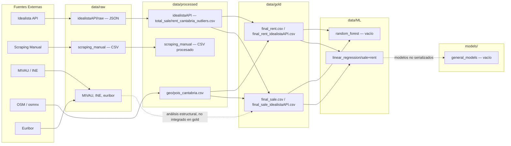
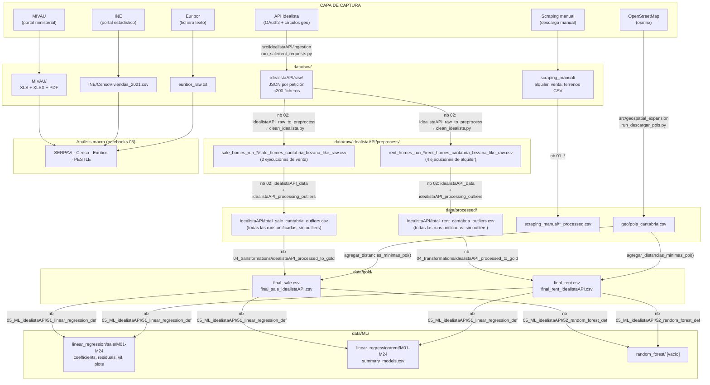
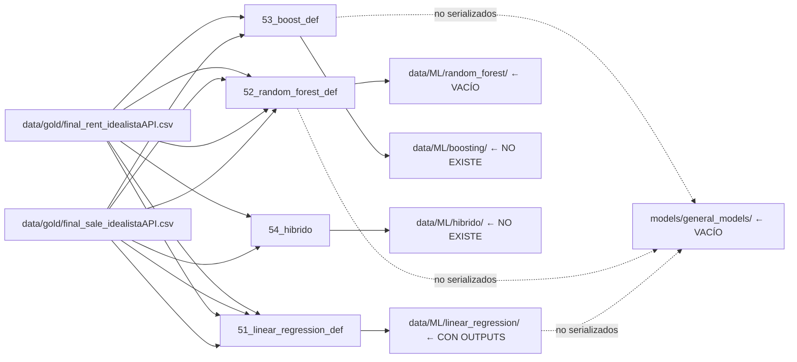
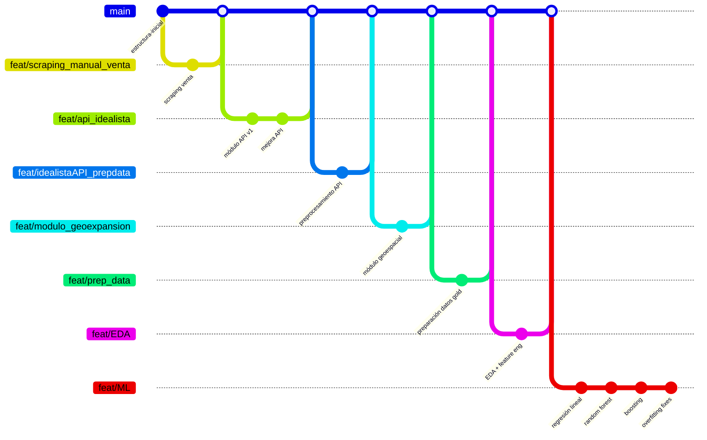

# Estructura Completa del Repositorio — BezanillaSL

**Versión:** 1.1
**Fecha de generación:** 2026-04-21
**Rama analizada:** `feat/final_data_and_md_structure` (HEAD: `bc0ff63`)
**Estado del repositorio:** limpio (sin cambios no confirmados)

> **Convención de etiquetas utilizadas en este documento:**
> - `[Verificado]` — observado directamente en archivos, rutas o código fuente.
> - `[Inferido]` — deducido razonablemente por nombres, estructura o contexto.
> - `[No verificado]` — posible, pero no demostrable con la evidencia encontrada.

---

## Tabla de contenidos

1. [Resumen ejecutivo del repositorio](#1-resumen-ejecutivo-del-repositorio)
2. [Estructura general del repositorio](#2-estructura-general-del-repositorio)
3. [Arquitectura funcional por dominios](#3-arquitectura-funcional-por-dominios)
4. [Flujo completo del dato](#4-flujo-completo-del-dato)
5. [Capas de datos y semántica de carpetas](#5-capas-de-datos-y-semántica-de-carpetas)
6. [Notebooks: catálogo y propósito](#6-notebooks-catálogo-y-propósito)
7. [Código fuente en `src`](#7-código-fuente-en-src)
8. [Modelado y outputs analíticos](#8-modelado-y-outputs-analíticos)
9. [Estrategia Git y ramas](#9-estrategia-git-y-ramas)
10. [Gobernanza técnica y de datos](#10-gobernanza-técnica-y-de-datos)
11. [Dependencias, entorno y reproducibilidad](#11-dependencias-entorno-y-reproducibilidad)
12. [Riesgos, huecos y deuda técnica](#12-riesgos-huecos-y-deuda-técnica)
13. [Recomendaciones priorizadas](#13-recomendaciones-priorizadas)
14. [Apéndice](#14-apéndice)
15. [Resumen de hallazgos clave](#resumen-de-hallazgos-clave)

---

## 1. Resumen ejecutivo del repositorio

### 1.1 Qué hace el proyecto

BezanillaSL es un sistema de analítica inmobiliaria orientado a validar la viabilidad de una empresa patrimonial familiar dedicada al segmento de **vivienda asequible (Affordable Housing)** en Cantabria, España. `[Verificado]` — README.md, línea 6.

El proyecto integra el desarrollo técnico y el estudio estratégico de dos Trabajos de Fin de Máster (TFM) simultáneos: el **MBA Tech** y el **Master en Business Analytics**.

### 1.2 Problema de negocio y técnico que resuelve

- **Problema de negocio:** sustituir la intuición tradicional del sector inmobiliario por un sistema de soporte a las decisiones basado en evidencia cuantitativa, que permita proyectar precios de compraventa y alquiler en municipios cántabros, evaluar la demanda estructural y estimar la viabilidad de una empresa promotora/gestora de vivienda asequible.
- **Problema técnico:** construir un pipeline de datos de extremo a extremo —desde la ingesta automatizada de datos de portales y fuentes oficiales hasta el entrenamiento, evaluación y comparación de modelos de predicción de precios inmobiliarios.

### 1.3 Grandes bloques funcionales

| Bloque | Descripción |
|---|---|
| **Ingesta de datos** | API Idealista (OAuth2), scraping manual de Idealista, fuentes estadísticas oficiales (MIVAU, INE, Euribor) |
| **Procesamiento y limpieza** | Normalización de CSVs, eliminación de duplicados, tratamiento de outliers |
| **Enriquecimiento geoespacial** | Descarga de POIs (OpenStreetMap/osmnx) y cálculo de distancias mínimas por categoría |
| **Análisis macro y estructural** | SERPAVI, Censo de Viviendas 2021, Euribor, análisis PESTLE |
| **EDA y feature engineering** | Análisis exploratorio de precios, ingeniería de variables para el gold layer |
| **Modelado ML** | Regresión lineal (OLS, Ridge, Lasso), bagging (Random Forest, Extra Trees), boosting (XGBoost, GBR, AdaBoost), modelos híbridos |
| **Documentación analítica** | Markdowns técnicos de resultados por familia de modelos, diagramas de arquitectura |

### 1.4 Stack y enfoque analítico

- **Lenguaje:** Python 3.12 (producción), Python 3.9 (entorno secundario `[Verificado]`)
- **Librerías principales:** `pandas`, `numpy`, `scikit-learn`, `matplotlib`, `seaborn`, `statsmodels`, `xgboost`, `osmnx`, `requests`
- **Infraestructura de datos:** sistema de archivos local con jerarquía de capas `raw → processed → gold → ML`
- **Sin base de datos relacional:** todo el estado de datos se gestiona en archivos CSV, JSON y XLS `[Verificado]`
- **Cuadernos Jupyter** como principal entorno de experimentación y análisis
- **Módulos Python de producción** en `src/` para operaciones repetibles (ingesta API, enriquecimiento geoespacial)
- **Control de versiones:** Git con estrategia de ramas por feature/dominio; remoto en GitHub (`origin`)

---

## 2. Estructura general del repositorio

### 2.1 Árbol resumido del repositorio

```
BezanillaSL/                          ← Raíz del proyecto
│
├── README.md                         ← Documentación principal (parcialmente desactualizada) [Verificado]
├── requirements.txt                  ← Dependencias globales del proyecto [Verificado]
├── .gitignore                        ← Exclusiones Git (venv, pycache, DS_Store, cache/) [Verificado]
│
├── data/                             ← Jerarquía de capas de datos
│   ├── raw/                          ← Datos originales sin transformar
│   │   ├── idealistaAPI/
│   │   │   ├── raw/                  ← JSON por petición API (≈100 ficheros por ejecución)
│   │   │   │   ├── sale_homes_run_20260218_173035/   ← Ejecución venta 1
│   │   │   │   ├── sale_homes_run_20260331_174125/   ← Ejecución venta 2
│   │   │   │   ├── rent_homes_run_20260220_111903/   ← Ejecución alquiler 1
│   │   │   │   ├── rent_homes_run_20260310_171627/   ← Ejecución alquiler 2
│   │   │   │   ├── rent_homes_run_20260401_135939/   ← Ejecución alquiler 3
│   │   │   │   ├── rent_homes_run_20260405_140420/   ← Ejecución alquiler 4
│   │   │   │   └── test/            ← Fixtures de prueba (elementList.jsonl, response_page1.json)
│   │   │   └── preprocess/          ← CSVs resultado de normalización JSON→CSV por ejecución
│   │   │       ├── sale_homes_run_20260218_173035/
│   │   │       ├── sale_homes_run_20260331_174125/
│   │   │       ├── rent_homes_run_20260220_111903/
│   │   │       ├── rent_homes_run_20260310_171627/
│   │   │       ├── rent_homes_run_20260401_135939/
│   │   │       └── rent_homes_run_20260405_140420/
│   │   ├── scraping_manual/         ← 3 CSVs obtenidos por scraping manual de Idealista
│   │   │   ├── alquiler_idealista.csv
│   │   │   ├── venta_idealista.csv
│   │   │   └── terrenos_idealista.csv
│   │   ├── MIVAU/                   ← Fuentes del Ministerio de Vivienda y Agenda Urbana
│   │   │   ├── README.md
│   │   │   ├── datos_alquiler/      ← SERPAVI 2011-2023 (XLSX) + PDFs metodología
│   │   │   ├── datos_suelo/         ← Estadísticas de precios de suelo urbano (XLS × 4)
│   │   │   └── datos_vivienda/      ← Estimación parque de viviendas (XLS × 2) + PDF
│   │   ├── INE/
│   │   │   └── CensoViviendas_2021.csv   ← Censo de Viviendas 2021
│   │   └── euribor_raw.txt          ← Serie histórica Euribor (formato texto)
│   │
│   ├── processed/                   ← Datos limpios y normalizados
│   │   ├── idealistaAPI/
│   │   │   ├── total_sale_cantabria_outliers.csv  ← Venta unificada (todas las runs) sin outliers
│   │   │   └── total_rent_cantabria_outliers.csv  ← Alquiler unificado (todas las runs) sin outliers
│   │   ├── scraping_manual/
│   │   │   ├── scraping_sale_processed.csv
│   │   │   ├── scraping_rent_processed.csv
│   │   │   └── scraping_land_processed.csv
│   │   └── geo/
│   │       └── pois_cantabria.csv   ← POIs descargados de OpenStreetMap
│   │
│   ├── gold/                        ← Datasets finales listos para ML
│   │   ├── final_sale.csv               ← Dataset venta combinado (API + scraping)
│   │   ├── final_rent.csv               ← Dataset alquiler combinado (API + scraping)
│   │   ├── final_sale_idealistaAPI.csv  ← Dataset venta solo fuente API
│   │   └── final_rent_idealistaAPI.csv  ← Dataset alquiler solo fuente API
│   │
│   └── ML/                          ← Outputs analíticos de experimentos ML
│       ├── linear_regression/
│       │   ├── sale/                ← M01_raw … M24_log (24 variantes)
│       │   └── rent/                ← M01_raw … M24_log (24 variantes)
│       │   │   └── summary_models.csv, summary_models_full.csv, summary_models_visual.html
│       └── random_forest/           ← [Verificado: directorio vacío — sin outputs persistidos]
│
├── docs/                            ← Documentación técnica y diagramas
│   ├── diagrams/
│   │   ├── idealistaapi_architecture.png
│   │   ├── idealistaapi_flow.png
│   │   ├── geospatial_architecture.png
│   │   └── geospatial_flow.png
│   ├── modelos_regresion_lineal.md  ← 469 líneas de análisis técnico
│   ├── modelos_bagging_random_forest.md  ← 651 líneas
│   └── modelos_boosting.md          ← 835 líneas
│
├── models/
│   └── general_models/              ← [Verificado: directorio vacío — sin modelos serializados]
│
├── notebooks/                       ← Cuadernos de análisis por etapa
│   ├── 01_manual_scraping_processing/   ← Procesamiento datos scraping manual (3 notebooks)
│   ├── 02_idealista_API_processing/     ← Limpieza, outliers y preprocesado API (3 notebooks)
│   ├── 03_macro_and_structural_analysis/← Análisis macro y estructural (4 notebooks)
│   ├── 04_transformations/              ← Transformación processed → gold (1 notebook)
│   ├── 05_ML_idealistaAPI/              ← Experimentos ML sobre datos API Idealista (≥20 ficheros)
│   └── 06_ML_scraping_land/             ← Experimentos ML sobre datos de terrenos (scraping manual)
│
├── src/                             ← Código de producción modularizado
│   ├── idealistaAPI/                ← Módulo de ingesta vía API Idealista
│   └── geospatial_expansion/        ← Módulo de enriquecimiento POI/OSM
│
├── cache/                           ← 32 ficheros JSON con hash (caché de cómputo) [Verificado]
└── .venv / .venv312/                ← Entornos virtuales locales (excluidos de Git) [Verificado]
```

### 2.2 Rol de cada carpeta top-level

| Carpeta | Rol | Contenido principal |
|---|---|---|
| `data/` | Pipeline de datos por capas | raw, processed, gold, ML |
| `src/` | Código de producción reutilizable | Módulos API e geoespacial |
| `notebooks/` | Experimentación y análisis | ~24 notebooks + 1 script .py |
| `docs/` | Documentación técnica | Markdowns de modelos + diagramas PNG |
| `models/` | Artefactos de modelos entrenados | **Vacío actualmente** `[Verificado]` |
| `cache/` | Caché de cómputo intermedio | 32 JSON con nombre hasheado |

### 2.3 Relación entre capas principales



---

## 3. Arquitectura funcional por dominios

### 3.1 Ingesta / captura de datos

**Fuente: API Idealista**
- Módulo: `src/idealistaAPI/`
- Mecanismo: OAuth2 client_credentials → Bearer token → búsqueda georreferenciada por círculos
- 10 círculos geográficos centrados en municipios de interés en Cantabria `[Verificado]`
- Runners CLI: `run_sale_requests.py`, `run_rent_requests.py`
- Output: ficheros JSON individuales por petición + `manifest.json`
- 2 ejecuciones documentadas: venta (2026-02-18) y alquiler (2026-02-20) `[Verificado]`

**Fuente: Scraping manual de Idealista**
- Mecanismo: extracción manual no automatizada (`[Inferido]` por ausencia de código de scraping en el repo)
- 3 CSVs en `data/raw/scraping_manual/`: venta, alquiler, terrenos
- Ramas remotas dedicadas: `feat/scraping_manual_venta_idealista`, `feat/scraping_manual_alquiler_idealista`, `feat/scraping_manual_terrenos_idealista` `[Verificado]`

**Fuente: MIVAU**
- Descarga manual de archivos desde el portal del Ministerio `[Inferido]`
- Formatos: XLSX (SERPAVI), XLS (suelo, vivienda), PDF (metodología)
- No hay script de descarga automatizada visible `[Verificado]`

**Fuente: INE**
- Un único fichero: `data/raw/INE/CensoViviendas_2021.csv` `[Verificado]`
- Descarga manual presumida `[Inferido]`

**Fuente: Euribor**
- Un único fichero texto: `data/raw/euribor_raw.txt` `[Verificado]`
- Procesado en `notebooks/03_macro_and_structural_analysis/analisis_euribor_tipos.ipynb`

**Fuente: OpenStreetMap (POIs)**
- Módulo: `src/geospatial_expansion/`
- Descarga mediante `osmnx` por categorías: playa, supermercado, colegio, hospital, farmacia
- Output: `data/processed/geo/pois_cantabria.csv`

### 3.2 Procesamiento y limpieza

- Normalización de JSON de la API a CSV mediante `pd.json_normalize()` en `src/idealistaAPI/processing/clean_idealista.py`, orquestado por `notebooks/02_idealista_API_processing/idealistaAPI_raw_to_preprocess.ipynb`
- Limpieza y validación de datos API en `notebooks/02_idealista_API_processing/idealistaAPI_data.ipynb` (venta + alquiler unificados en un único notebook)
- Eliminación de outliers mediante regla IQR×1.5 en `notebooks/02_idealista_API_processing/idealistaAPI_processing_outliers.ipynb` (movido de la carpeta 04_EDA) `[Verificado]`
- Los resultados de todas las ejecuciones se consolidan en `data/processed/idealistaAPI/total_sale_cantabria_outliers.csv` y `total_rent_cantabria_outliers.csv`
- Limpieza de datos scraping en `notebooks/01_manual_scraping_processing/` (3 notebooks renombrados)

### 3.3 Enriquecimiento geoespacial

- Módulo `src/geospatial_expansion/` descarga POIs de OSM y calcula distancia Haversine mínima por categoría
- Variables resultantes incorporadas al gold layer: `distancia_min_playa_km`, `distancia_min_supermercado_km`, `distancia_min_colegio_km`
- Variable compuesta: `score_cercania_servicios` `[Verificado]`

### 3.4 Transformaciones (processed → gold)

La carpeta `04_EDA` ha sido renombrada a `04_transformations` y simplificada. El EDA exploratorio y el tratamiento de outliers han migrado a los notebooks `02_*`. Esta capa contiene ahora un único notebook de transformación:

- `notebooks/04_transformations/idealistaAPI_processed_to_gold.ipynb` — genera el gold layer a partir de los datos procesados y sin outliers: encoding de categorías, variables geoespaciales (POI distances), dummies de municipio y transformación logarítmica del target `[Verificado]`

### 3.5 Análisis macro y estructural

- SERPAVI: análisis de precios de referencia de alquiler por municipio y período 2011–2023
- Censo de Viviendas 2021: análisis del parque residencial cántabro
- Euribor/tipos: análisis de condiciones de financiación y contexto macroeconómico
- PESTLE: análisis estratégico cualitativo del entorno del negocio
- Estos análisis nutren el TFM de MBA pero **no se integran directamente en el gold layer** `[Verificado — no aparecen variables macro en final_sale.csv/final_rent.csv]`

### 3.6 Feature engineering

- Realizado en `notebooks/04_transformations/idealistaAPI_processed_to_gold.ipynb` `[Verificado]`
- Variables creadas (presentes en `final_sale.csv` y `final_rent.csv`):
  - `log_precio` — variable objetivo transformada (log natural del precio)
  - `precio_m2_municipio_media` — precio medio por m² a nivel municipal `[Inferido]`
  - Dummies de tipología: `tipologia_unificada_piso`, `tipologia_unificada_unifamiliar`
  - Dummies de municipio: 13–14 variables para venta, 9 para alquiler
  - `score_cercania_servicios` — índice compuesto de proximidad a servicios
  - `tiene_garaje`, `obra_nueva` — características binarias del inmueble

### 3.7 Modelado ML

- 3 familias de modelos + híbridos, documentados en `notebooks/05_ML_idealistaAPI/`
- Véase sección 8 para detalle completo

### 3.8 Outputs / documentación / modelos

- Outputs analíticos: CSVs de coeficientes, residuales, VIF e imágenes de diagnóstico en `data/ML/linear_regression/`
- Documentación técnica: 3 markdowns en `docs/` (total >1.900 líneas)
- **Modelos serializados: ninguno** — `models/general_models/` está vacío `[Verificado]`

---

## 4. Flujo completo del dato

### 4.1 Diagrama de data lineage



### 4.2 Tabla de trazabilidad de datos (Data Lineage)

| Fuente | Método de captura | Ruta de entrada | Proceso de transformación | Ruta de salida | Consumidor final | Madurez / Observaciones |
|---|---|---|---|---|---|---|
| API Idealista (venta) | OAuth2 + CLI `ingestion/run_sale_requests.py` | `data/raw/idealistaAPI/raw/sale_homes_run_*/` (2 ejecuciones) | `idealistaAPI_raw_to_preprocess.ipynb` → `clean_idealista.py` → `idealistaAPI_data.ipynb` → `idealistaAPI_processing_outliers.ipynb` | `data/processed/idealistaAPI/total_sale_cantabria_outliers.csv` | `data/gold/final_sale.csv`, `final_sale_idealistaAPI.csv` | `[Verificado]` — 2 ejecuciones documentadas |
| API Idealista (alquiler) | OAuth2 + CLI `ingestion/run_rent_requests.py` | `data/raw/idealistaAPI/raw/rent_homes_run_*/` (4 ejecuciones) | `idealistaAPI_raw_to_preprocess.ipynb` → `clean_idealista.py` → `idealistaAPI_data.ipynb` → `idealistaAPI_processing_outliers.ipynb` | `data/processed/idealistaAPI/total_rent_cantabria_outliers.csv` | `data/gold/final_rent.csv`, `final_rent_idealistaAPI.csv` | `[Verificado]` — 4 ejecuciones documentadas |
| Scraping manual Idealista (venta) | Manual — descarga directa de CSV | `data/raw/scraping_manual/venta_idealista.csv` | nb `01/scraping_sale_processing.ipynb` | `data/processed/scraping_manual/scraping_sale_processed.csv` | Integrado en `data/gold/final_sale.csv` `[Inferido]` | `[Verificado]` — dataset complementario |
| Scraping manual Idealista (alquiler) | Manual | `data/raw/scraping_manual/alquiler_idealista.csv` | nb `01/scraping_rent_processing.ipynb` | `data/processed/scraping_manual/scraping_rent_processed.csv` | Integrado en `data/gold/final_rent.csv` `[Inferido]` | `[Verificado]` — dataset complementario |
| Scraping manual Idealista (terrenos) | Manual | `data/raw/scraping_manual/terrenos_idealista.csv` | nb `01/scraping_land_processing.ipynb` | `data/processed/scraping_manual/scraping_land_processed.csv` | `[No verificado]` — sin consumidor identificado en gold/ML | Análisis descriptivo únicamente |
| OpenStreetMap (POIs) | `osmnx` via `run_descargar_pois.py` | API OSM (remota) | `osm_downloader.py` → `enricher.py` | `data/processed/geo/pois_cantabria.csv` → gold layer | `data/gold/final_sale.csv`, `final_rent.csv` | `[Verificado]` — variables de distancia presentes en gold |
| MIVAU — SERPAVI | Descarga manual del portal MIVAU | `data/raw/MIVAU/datos_alquiler/2025-09-10_bd_SERPAVI_2011-2023.xlsx` | nb `03/analisis_SERPAVI.ipynb` | Sin output en processed `[Verificado]` | TFM MBA (análisis estructural) | `[Verificado]` — solo análisis descriptivo, no integrado en ML |
| MIVAU — suelo urbano | Descarga manual | `data/raw/MIVAU/datos_suelo/*.XLS` | `[No verificado]` — sin notebook identificado | `[No verificado]` | `[No verificado]` | Posiblemente solo referencia informativa |
| MIVAU — parque viviendas | Descarga manual | `data/raw/MIVAU/datos_vivienda/*.XLS` | `[No verificado]` — sin notebook identificado | `[No verificado]` | `[No verificado]` | Posiblemente solo referencia informativa |
| INE — Censo Viviendas 2021 | Descarga manual del INE | `data/raw/INE/CensoViviendas_2021.csv` | nb `03/analisis_censoviviendas.ipynb` | Sin output en processed `[Verificado]` | TFM MBA (análisis estructural) | `[Verificado]` — análisis descriptivo únicamente |
| Euribor / tipos | Fichero texto descargado manualmente | `data/raw/euribor_raw.txt` | nb `03/analisis_euribor_tipos.ipynb` | Sin output en processed `[Verificado]` | TFM MBA (contexto macro) | `[Verificado]` — análisis contextual, no integrado en ML |

---

## 5. Capas de datos y semántica de carpetas

### 5.1 `data/raw/`

**Criterio de clasificación:** datos originales sin ninguna transformación aplicada por el proyecto. Equivalente a la zona de aterrizaje (landing zone) en arquitecturas de datos. `[Verificado]`

**Nivel de transformación:** ninguno. Los datos están en el mismo estado en que se obtuvieron de la fuente.

**Datasets concretos:**

| Fichero | Fuente | Formato | Descripción |
|---|---|---|---|
| `idealistaAPI/raw/sale_homes_run_20260218_173035/req*.json` | API Idealista | JSON | ~100 ficheros con respuestas paginadas de búsqueda de viviendas en venta |
| `idealistaAPI/raw/rent_homes_run_20260220_111903/req*.json` | API Idealista | JSON | ~100 ficheros de alquiler; incluye `req100__ERROR.json` |
| `idealistaAPI/raw/test/elementList.jsonl`, `response_page1.json` | API Idealista (test) | JSON/JSONL | Fixtures para pruebas durante desarrollo |
| `idealistaAPI/preprocess/sale_homes_run_20260218_173035/sale_homes_cantabria_bezana_like_raw.csv` | API Idealista | CSV | Primera normalización de JSON → CSV plano (venta) |
| `idealistaAPI/preprocess/rent_homes_run_20260220_111903/rent_homes_cantabria_bezana_like_raw.csv` | API Idealista | CSV | Primera normalización de JSON → CSV plano (alquiler) |
| `scraping_manual/alquiler_idealista.csv` | Scraping manual | CSV | Datos de alquiler obtenidos manualmente |
| `scraping_manual/venta_idealista.csv` | Scraping manual | CSV | Datos de venta obtenidos manualmente |
| `scraping_manual/terrenos_idealista.csv` | Scraping manual | CSV | Datos de terrenos obtenidos manualmente |
| `MIVAU/datos_alquiler/2025-09-10_bd_SERPAVI_2011-2023.xlsx` | MIVAU | XLSX | Serie histórica de precios de alquiler de referencia (SERPAVI) 2011–2023 |
| `MIVAU/datos_suelo/36*.XLS` (×4) | MIVAU | XLS | Estadísticas de precios de suelo urbano por trimestre |
| `MIVAU/datos_vivienda/33*.XLS` (×2) | MIVAU | XLS | Estimaciones del parque de viviendas |
| `INE/CensoViviendas_2021.csv` | INE | CSV | Censo de Viviendas 2021 |
| `euribor_raw.txt` | Fuente no especificada | TXT | Serie histórica del Euribor |

**Observación sobre `data/raw/idealistaAPI/preprocess/`:** `[Inferido]` — Esta subcarpeta (`preprocess/`) se ubica físicamente dentro de `data/raw/`, lo que es técnicamente inconsistente con su contenido (primeras transformaciones de JSON a CSV). Semánticamente debería estar en `data/processed/idealistaAPI/`. Esta ambigüedad refleja una evolución orgánica del pipeline.

### 5.2 `data/processed/`

**Criterio de clasificación:** datos que han sido limpiados, normalizados y validados por el proyecto, pero que aún no han pasado por feature engineering completo. Equivalente a una capa Silver en arquitecturas medallion. `[Inferido]`

**Nivel de transformación:** normalización de esquemas, eliminación de duplicados, tratamiento básico de nulos, outlier removal preliminar.

**Datasets concretos:**

| Fichero | Origen | Descripción |
|---|---|---|
| `idealistaAPI/total_sale_cantabria_outliers.csv` | todas las runs de venta → nb `02/idealistaAPI_data` + `idealistaAPI_processing_outliers` | Venta consolidada (2 runs, ~200 peticiones) sin outliers (IQR×1.5) |
| `idealistaAPI/total_rent_cantabria_outliers.csv` | todas las runs de alquiler → nb `02/idealistaAPI_data` + `idealistaAPI_processing_outliers` | Alquiler consolidado (4 runs, ~400 peticiones) sin outliers (IQR×1.5) |
| `scraping_manual/scraping_sale_processed.csv` | `raw/scraping_manual/` → nb `01/scraping_sale_processing` | Datos de venta scraping limpios |
| `scraping_manual/scraping_rent_processed.csv` | `raw/scraping_manual/` → nb `01/scraping_rent_processing` | Datos de alquiler scraping limpios |
| `scraping_manual/scraping_land_processed.csv` | `raw/scraping_manual/` → nb `01/scraping_land_processing` | Datos de terrenos scraping limpios |
| `geo/pois_cantabria.csv` | OpenStreetMap via osmnx | POIs geolocalizados por categoría (playa, supermercado, colegio, etc.) |

**Nota sobre nomenclatura `*_outliers.csv`:** el sufijo `_cantabria_outliers` indica que son los datos del área de Cantabria con outliers ya eliminados (IQR×1.5 sobre log del precio). Son los datasets de entrada directa al gold layer.

### 5.3 `data/gold/`

**Criterio de clasificación:** datasets finales, listos para consumo en modelos ML y análisis estadísticos. Incorporan feature engineering completo, transformación logarítmica del target, variables geoespaciales y codificación de variables categóricas. Equivalente a la capa Gold en arquitecturas medallion. `[Verificado]`

**Nivel de transformación:** máximo. Outlier removal, selección de features, encoding de categorías, variables de proximidad POI, variable objetivo transformada.

**Datasets concretos:**

| Fichero | Descripción | Variable objetivo | Cobertura geográfica |
|---|---|---|---|
| `final_sale.csv` | Venta combinada (API + scraping manual) | `log_precio` | Municipios de Cantabria |
| `final_rent.csv` | Alquiler combinado (API + scraping manual) | `log_precio` | Municipios de Cantabria |
| `final_sale_idealistaAPI.csv` | Venta solo de fuente API Idealista | `log_precio` | Municipios de Cantabria |
| `final_rent_idealistaAPI.csv` | Alquiler solo de fuente API Idealista | `log_precio` | Municipios de Cantabria |

**Variables clave presentes en los gold datasets** `[Verificado]`:
- Estructurales: `superficie_construida_m2`, `numero_dormitorios`, `numero_banos`
- Tipología: `tipologia_unificada_piso`, `tipologia_unificada_unifamiliar`
- Características: `tiene_garaje`, `obra_nueva`
- Geoespaciales: `distancia_min_playa_km`, `distancia_min_supermercado_km`, `distancia_min_colegio_km`, `distancia_centro_municipio_km`, `score_cercania_servicios`
- Mercado: `precio_m2_municipio_media`
- Dummies de municipio: Camargo, Castro-Urdiales, Laredo, Noja, Piélagos, Polanco, Santa Cruz de Bezana, Santander, Santoña, Santurtzi, Suances, Torrelavega, Voto (y otros)
- Target: `log_precio` (logaritmo natural del precio de venta/alquiler)

### 5.4 `data/ML/`

**Criterio de clasificación:** outputs analíticos generados por los experimentos de machine learning. No son datos de entrada sino resultados de experimentos. `[Inferido]`

**Nivel de transformación:** no aplica — son artefactos de salida, no datos de entrada.

**Datasets y artefactos concretos** `[Verificado]`:

| Ruta | Contenido | Estado |
|---|---|---|
| `linear_regression/sale/M01_raw … M24_log/` | coeficientes.csv, residuals.csv, vif.csv, residual_plots.png | Con contenido (24 variantes × 4 ficheros) |
| `linear_regression/rent/M01_raw … M24_log/` | coeficientes.csv, residuals.csv, vif.csv, residual_plots.png | Con contenido (24 variantes × 4 ficheros) |
| `linear_regression/rent/summary_models.csv` | Tabla comparativa de métricas de todos los modelos | Con contenido |
| `linear_regression/rent/summary_models_full.csv` | Versión extendida del resumen | Con contenido |
| `linear_regression/rent/summary_models_visual.html` | Resumen visual interactivo (HTML) | Con contenido |
| `random_forest/` | — | **Vacío** — sin outputs persistidos |

**Observación crítica:** no existe un directorio `data/ML/boosting/`. Los outputs de los notebooks de boosting (53_*) no han sido persistidos en el sistema de archivos. `[Verificado]`

---

## 6. Notebooks: catálogo y propósito

### 6.1 Catálogo completo por carpeta

#### `notebooks/01_manual_scraping_processing/` — Procesamiento de scraping manual

| Notebook | Objetivo | Inputs | Outputs | Etapa | Tipo |
|---|---|---|---|---|---|
| `scraping_sale_processing.ipynb` | Limpieza y transformación de datos de venta scraping | `data/raw/scraping_manual/venta_idealista.csv` | `data/processed/scraping_manual/scraping_sale_processed.csv` | Procesamiento | Productivo |
| `scraping_rent_processing.ipynb` | Limpieza y transformación de datos de alquiler scraping | `data/raw/scraping_manual/alquiler_idealista.csv` | `data/processed/scraping_manual/scraping_rent_processed.csv` | Procesamiento | Productivo |
| `scraping_land_processing.ipynb` | Limpieza y transformación de datos de terrenos | `data/raw/scraping_manual/terrenos_idealista.csv` | `data/processed/scraping_manual/scraping_land_processed.csv` | Procesamiento | Exploratorio |

#### `notebooks/02_idealista_API_processing/` — Procesamiento de datos API

| Notebook | Objetivo | Inputs | Outputs | Etapa | Tipo |
|---|---|---|---|---|---|
| `idealistaAPI_raw_to_preprocess.ipynb` | Orquesta la conversión de JSON a CSV usando `clean_idealista.py` para todas las ejecuciones | `data/raw/idealistaAPI/raw/*/req*.json` | `data/raw/idealistaAPI/preprocess/*/` CSV por run | Ingesta | Productivo |
| `idealistaAPI_data.ipynb` | Limpieza, validación y unificación de CSVs de todas las ejecuciones (venta + alquiler) | `data/raw/idealistaAPI/preprocess/*/` | Datasets limpios intermedios | Procesamiento | Productivo |
| `idealistaAPI_processing_outliers.ipynb` | Eliminación de outliers (IQR×1.5 sobre log del precio) y consolidación de todas las runs | Datasets limpios intermedios | `data/processed/idealistaAPI/total_sale_cantabria_outliers.csv`, `total_rent_cantabria_outliers.csv` | Procesamiento | **Productivo-crítico** |

#### `notebooks/03_macro_and_structural_analysis/` — Análisis macro y estructural

| Notebook | Objetivo | Inputs | Outputs | Etapa | Tipo |
|---|---|---|---|---|---|
| `analisis_SERPAVI.ipynb` | Análisis de precios de alquiler de referencia por municipio y período | `data/raw/MIVAU/datos_alquiler/2025-09-10_bd_SERPAVI_2011-2023.xlsx` | Gráficas + insights (sin output en processed) | Análisis | Exploratorio |
| `analisis_censoviviendas.ipynb` | Análisis del parque de viviendas en Cantabria | `data/raw/INE/CensoViviendas_2021.csv` | Gráficas + insights | Análisis | Exploratorio |
| `analisis_euribor_tipos.ipynb` | Análisis de tipos de interés y contexto macroeconómico | `data/raw/euribor_raw.txt` | Gráficas + insights | Análisis | Exploratorio |
| `analisis_pestle.ipynb` | Análisis estratégico PESTLE del entorno inmobiliario | `[No verificado]` — posiblemente sin inputs de datos | Análisis cualitativo | Estrategia | Exploratorio |

#### `notebooks/04_transformations/` — Transformación processed → gold

Esta carpeta (antes llamada `04_EDA`) contiene ahora un único notebook de transformación. El EDA exploratorio y el tratamiento de outliers se realizan en los notebooks `02_*`.

| Notebook | Objetivo | Inputs | Outputs | Etapa | Tipo |
|---|---|---|---|---|---|
| `idealistaAPI_processed_to_gold.ipynb` | Genera el gold layer: feature engineering, encoding, distancias POI, dummies de municipio, log-target. Produce versiones API-only y combinadas (API + scraping) | `data/processed/idealistaAPI/total_sale/rent_cantabria_outliers.csv`, `data/processed/geo/pois_cantabria.csv` | `data/gold/final_sale.csv`, `final_rent.csv`, `final_sale_idealistaAPI.csv`, `final_rent_idealistaAPI.csv` | Transformación | **Productivo-crítico** |

#### `notebooks/05_ML_idealistaAPI/` — Experimentos de machine learning sobre datos API Idealista

| Notebook / Fichero | Objetivo | Inputs | Outputs | Etapa | Tipo |
|---|---|---|---|---|---|
| `50_unificar_dataset.ipynb` | Unificación de venta + alquiler en un único dataset ML | `data/gold/` | Dataset unificado para análisis comparativos | Prep ML | Experimental |
| `51_linear_regression_1.py` | Primer experimento de regresión lineal (script Python) | `data/gold/` | `[Inferido]` — experimento temprano | ML | Obsoleto/experimental |
| `51_linear_regression_2.ipynb` | Segunda iteración de regresión lineal | `data/gold/` | `data/ML/linear_regression/` (parcial) | ML | Obsoleto/experimental |
| `51_linear_regression_ridge.ipynb` | Experimento específico de Ridge | `data/gold/` | `data/ML/linear_regression/` (parcial) | ML | Experimental |
| `51_linear_regression_lasso.ipynb` | Experimento específico de Lasso | `data/gold/` | `data/ML/linear_regression/` (parcial) | ML | Experimental |
| `51_linear_regression_def.ipynb` | **DEFINITIVO v1** — OLS, Ridge y Lasso+OLS comparados con CV | `data/gold/final_sale.csv`, `final_rent.csv` | `data/ML/linear_regression/sale+rent/M01-M24/` | ML | **Productivo-definitivo** |
| `51_linear_regression_def_2.ipynb` | **DEFINITIVO v2** — versión revisada/mejorada de regresión lineal | `data/gold/` | `data/ML/linear_regression/` | ML | **Productivo-definitivo** |
| `52_random_forest_1.ipynb` | Primer experimento Random Forest | `data/gold/` | `data/ML/random_forest/` (vacío) | ML | Obsoleto/experimental |
| `52_random_forest_2.ipynb` | Segunda iteración Random Forest | `data/gold/` | `data/ML/random_forest/` (vacío) | ML | Experimental |
| `52_random_forest_scraping.ipynb` | RF sobre datos de scraping manual (alternativa) | `data/processed/scraping_manual/` | `[Inferido]` — sin output identificado | ML | Experimental |
| `52_random_forest_def.ipynb` | **DEFINITIVO v1** — RF, Extra Trees, RF regularizado con GridSearchCV | `data/gold/final_sale.csv`, `final_rent.csv` | `data/ML/random_forest/` (vacío — outputs no persistidos) | ML | **Productivo-definitivo** |
| `52_random_forest_def_2.ipynb` | **DEFINITIVO v2** — versión revisada/mejorada de Random Forest | `data/gold/` | `data/ML/random_forest/` | ML | **Productivo-definitivo** |
| `53_boost_1.ipynb` | Primer experimento Boosting | `data/gold/` | Sin outputs persistidos | ML | Obsoleto/experimental |
| `53_boost_reg.ipynb` | Boosting con regularización | `data/gold/` | Sin outputs persistidos | ML | Experimental |
| `53_boost_def.ipynb` | **DEFINITIVO v1** — XGBoost, GBR, AdaBoost con GridSearchCV | `data/gold/` | Sin outputs persistidos | ML | **Productivo-definitivo** |
| `53_boost_def_2.ipynb` | **DEFINITIVO v2** — XGBoost optimizado con Optuna | `data/gold/` | Sin outputs persistidos | ML | **Productivo-definitivo** |
| `53_boost_def_3.ipynb` | **DEFINITIVO v3** — XGBoost optimizado individualmente por operación | `data/gold/` | Sin outputs persistidos | ML | **Productivo-definitivo** |
| `53_boost_sale.ipynb` | XGBoost optimizado con Optuna específicamente para venta | `data/gold/final_sale.csv` | Sin outputs persistidos | ML | **Productivo-definitivo** |
| `53_boost_rent.ipynb` | XGBoost optimizado con Optuna específicamente para alquiler | `data/gold/final_rent.csv` | Sin outputs persistidos | ML | **Productivo-definitivo** |
| `54_hibrido.ipynb` | Ensemble híbrido combinando familias de modelos | `data/gold/` | `[No verificado]` | ML | Experimental |
| `54_hibrido_2.ipynb` | Ensemble híbrido v2 | `data/gold/` | `[No verificado]` | ML | Experimental |
| `55_input_result.ipynb` | Comparación de resultados de modelos con distintos datasets de entrada (k-fold) | `data/gold/` | Tablas comparativas | ML | Análisis |
| `55_input_result_no_k_fold.ipynb` | Comparación de resultados sin k-fold cross-validation | `data/gold/` | Tablas comparativas | ML | Análisis |
| `55_sale_rent_models.ipynb` | Comparación final de modelos de venta y alquiler entre sí | `data/gold/` | Resumen global de modelos | ML | Análisis |

#### `notebooks/06_ML_scraping_land/` — Experimentos ML sobre datos de terrenos

Carpeta destinada a los experimentos de machine learning utilizando los datos de terrenos obtenidos por scraping manual de Idealista. **Actualmente vacía** — pendiente de desarrollo. `[Verificado]`

| Notebook | Objetivo | Inputs | Outputs | Etapa | Tipo |
|---|---|---|---|---|---|
| — | *Por desarrollar* | `data/processed/scraping_manual/scraping_land_processed.csv` | — | ML | Pendiente |

### 6.2 Riesgos identificados en notebooks

| Riesgo | Notebooks afectados | Severidad |
|---|---|---|
| **Ejecución secuencial obligatoria** — el estado de variables y DataFrames depende del orden de ejecución de las celdas | Todos los notebooks | Alta |
| **Rutas hardcodeadas** — rutas relativas que dependen de que el CWD sea la raíz del repo | `[Inferido]` — común en notebooks de data science | Media |
| **Notebooks experimentales sin marcar** — ficheros como `51_linear_regression_1.py`, `52_random_forest_1.ipynb`, `53_boost_1.ipynb` coexisten con múltiples versiones `_def`, `_def_2`, `_def_3` sin indicador canónico de cuál es el definitivo final | `05_ML_idealistaAPI/` | Alta |
| **Outputs no persistidos** — los notebooks definitivos de RF y boosting no guardan resultados a disco | `52_random_forest_def*.ipynb`, `53_boost_def*.ipynb`, `53_boost_sale/rent.ipynb` | Alta |
| **Duplicación con `src/`** — parte de la lógica de limpieza de los notebooks 01 y 02 probablemente replica `clean_idealista.py` | `01_*`, `02_*` | Media |
| **Reproducibilidad limitada** — aunque se usa `random_state=42`, no hay control explícito de versión de datos de entrada (sin checksums) | Todos los notebooks ML | Media |
| **Proliferación de versiones `_def_N`** — hay 3 versiones de boosting definitivo (`def`, `def_2`, `def_3`) más versiones separadas por operación (`sale`, `rent`); sin documentación de cuál es la versión canónica final | `05_ML_idealistaAPI/53_*` | Alta |

---

## 7. Código fuente en `src`

### 7.1 `src/idealistaAPI/` — Módulo de ingesta vía API Idealista

**Responsabilidad funcional:** automatizar la descarga de datos de viviendas de Idealista mediante su API oficial, con gestión de autenticación OAuth2, paginación, rate-limiting y tolerancia a fallos.

**Estructura del módulo:**

```
src/idealistaAPI/
├── config/
│   ├── __init__.py
│   └── idealista.py                   ← Configuración: rutas, límites, círculos geográficos
├── ingestion/
│   ├── __init__.py
│   ├── client.py                      ← Cliente HTTP + gestión de tokens (OAuth2)
│   ├── api_types.py                   ← TypedDicts: PropertyItem, SearchResponse
│   ├── run_sale_requests.py           ← Punto de entrada CLI (venta)
│   ├── run_rent_requests.py           ← Punto de entrada CLI (alquiler)
│   ├── run_extended_rent_requests.py  ← CLI ampliada para alquiler (más ejecuciones)
│   ├── test_one_request.py            ← Script de prueba de una sola petición
│   └── services/
│       ├── __init__.py
│       └── request_service.py         ← Lógica principal de orquestación (>500 líneas)
├── processing/
│   ├── __init__.py
│   └── clean_idealista.py             ← JSON → CSV normalizado
├── README.md
└── idealista_API_userguide.md
```

**Scripts principales y su rol:**

| Fichero | Rol | Inputs | Outputs |
|---|---|---|---|
| `ingestion/client.py` | Clase `IdealistaClient`: autenticación OAuth2, requests con retry exponencial | Variables de entorno `IDEALISTA_CLIENT_ID`, `IDEALISTA_CLIENT_SECRET` | Token Bearer cacheado, respuestas JSON |
| `config/idealista.py` | Constantes de configuración: rutas base, límites API, 10 círculos geográficos | — | Constantes importables por el resto del módulo |
| `ingestion/api_types.py` | Tipado estático de respuestas de la API | — | `PropertyItem`, `SearchResponse` TypedDicts |
| `ingestion/services/request_service.py` | Orquestador: round-robin entre círculos, detección adaptativa de páginas, gestión de cuota | Config, `IdealistaClient` | JSON por petición + `manifest.json` en `data/raw/idealistaAPI/raw/<run>/` |
| `processing/clean_idealista.py` | Conversión de JSONs de un run completo a CSV normalizado | `data/raw/idealistaAPI/raw/<run>/` | CSV en `data/raw/idealistaAPI/preprocess/<run>/` |
| `ingestion/run_sale_requests.py` | CLI para iniciar descarga de venta | `--max-requests`, `--output-csv` | Invoca `request_service.run_new()` |
| `ingestion/run_rent_requests.py` | CLI para iniciar descarga de alquiler | `--max-requests`, `--output-csv` | Invoca `request_service.run_new()` |
| `ingestion/run_extended_rent_requests.py` | CLI ampliada para ejecuciones adicionales de alquiler | `--max-requests` | Invoca `request_service.run_new()` con configuración extendida |
| `ingestion/test_one_request.py` | Script de diagnóstico para testear una única petición | Credenciales de entorno | Respuesta JSON de una petición de prueba |

**Decisiones técnicas destacables:**
- **Round-robin geográfico justo:** las peticiones se distribuyen equitativamente entre los 10 círculos para evitar sesgo geográfico en la cobertura
- **Detección adaptativa de páginas:** si una respuesta contiene menos de 50 inmuebles (MAX_ITEMS), se interpreta como última página y se pasa al siguiente círculo
- **Gestión de cuota:** la ejecución se detiene cuando se alcanza `--max-requests` para respetar los límites de la API
- **Credenciales por variables de entorno:** ninguna credencial hardcodeada `[Verificado]`
- **Error file:** `req100__ERROR.json` presente en la ejecución de alquiler `[Verificado]` — indica que la petición 100 falló; el sistema registra el error y continúa

**Dependencias específicas:** `requests>=2.31`, `pandas>=2.2`

### 7.2 `src/geospatial_expansion/` — Módulo de enriquecimiento geoespacial

**Responsabilidad funcional:** descargar puntos de interés (POIs) de OpenStreetMap y enriquecer datasets inmobiliarios con las distancias mínimas en kilómetros a cada categoría de POI.

**Estructura del módulo:**

```
src/geospatial_expansion/
├── __init__.py                        ← Exporta agregar_distancias_minimas_poi()
├── common/
│   ├── __init__.py
│   └── distance.py                    ← haversine_m(), nearest_point()
├── download/
│   ├── __init__.py
│   └── osm_downloader.py              ← Descarga POIs de OSM (>150 líneas)
├── expand/
│   ├── __init__.py
│   └── enricher.py                    ← Cálculo de distancias mínimas (>200 líneas)
├── run_descargar_pois.py              ← CLI: descarga POIs y guarda CSV
├── geospatial_expansion_userguide.md
└── README.md (inferido)
```

**Scripts principales y su rol:**

| Fichero | Rol | Inputs | Outputs |
|---|---|---|---|
| `common/distance.py` | Funciones de geometría: `haversine_m()`, `nearest_point()` | Coordenadas lat/lon | Distancia en metros, POI más cercano |
| `download/osm_downloader.py` | Descarga POIs de OSM por categoría y bounding box mediante `osmnx` | Lista de círculos geográficos + categorías | DataFrame con (circulo, categoria, nombre, latitude, longitude) → CSV |
| `expand/enricher.py` | Carga POIs y calcula distancia mínima por categoría para cada inmueble | DataFrame con coordenadas + CSV de POIs | DataFrame enriquecido con columnas `distancia_min_<categoria>_km` |
| `run_descargar_pois.py` | CLI: ejecuta descarga de POIs para categorías configuradas | — | `data/processed/geo/pois_cantabria.csv` |

**Integración en el pipeline:**
1. Paso 1 (preparación, ejecutar una vez): `python -m src.geospatial_expansion.run_descargar_pois`
2. Paso 2 (enriquecimiento, desde notebooks o scripts): `from src.geospatial_expansion import agregar_distancias_minimas_poi`

**Dependencias específicas:** `pandas>=2.2`, `osmnx>=1.9`

### 7.3 Módulos `src/ingestion/` y `src/processing/`

`[Verificado]` — Existen dos directorios `src/ingestion/` y `src/processing/` a nivel de `src/` pero están vacíos (solo contienen `__pycache__/`). No tienen código implementado. Son marcadores de posición o artefactos de una refactorización planificada. La funcionalidad de ingesta y procesamiento reside dentro de los submódulos de `src/idealistaAPI/ingestion/` y `src/idealistaAPI/processing/` respectivamente.

---

## 8. Modelado y outputs analíticos

### 8.1 Evidencia de experimentos de ML

`[Verificado]` — El repositorio contiene evidencia extensiva de experimentación ML: 14 ficheros en `notebooks/05_ML_idealistaAPI/`, 3 documentos técnicos en `docs/` con más de 1.900 líneas de análisis, y outputs en `data/ML/linear_regression/` con 48 subdirectorios de experimentos (24 variantes × 2 operaciones).

### 8.2 Datasets de entrenamiento

- **Venta:** `data/gold/final_sale.csv` — 588 filas, partición 80/20 (train/test), usando `random_state=42`
- **Alquiler:** `data/gold/final_rent.csv` — 477 filas, misma partición
- La partición se realiza **dentro de cada notebook** con `train_test_split()` — no hay splits pre-generados en disco `[Verificado]`

### 8.3 Resultados de modelos por familia

#### Regresión lineal (`51_linear_regression_def.ipynb`)

| Modelo | Operación | RMSE_test | R²_test | Features |
|---|---|---|---|---|
| OLS Base | Venta | 0.3021 | 0.6326 | 11 |
| Ridge | Venta | **0.2997** | **0.6384** | 35 (incl. municipios) |
| Lasso+OLS | Venta | 0.3028 | 0.6308 | 26 |
| OLS Base | Alquiler | 0.2160 | 0.5641 | 11 |
| Ridge | Alquiler | 0.2170 | 0.5612 | — |
| Lasso+OLS | Alquiler | **0.2133** | **0.5755** | 26 |

#### Bagging / Random Forest (`52_random_forest_def.ipynb`)

| Modelo | Operación | RMSE_test | R²_test | Nota |
|---|---|---|---|---|
| Extra Trees óptimo | Venta | **0.2827** | **0.7065** | Mejor modelo global para venta |
| RF óptimo | Venta | 0.3060 | 0.6565 | — |
| RF óptimo | Alquiler | 0.2739 | 0.4500 | — |
| Extra Trees óptimo | Alquiler | Peor que RF | < 0.45 | ET inadecuado con n pequeño |

**Fenómeno notable:** Extra Trees base presenta overfitting extremo (R²_train=0.9999, R²_test≈0.70). El modelo óptimo tras GridSearchCV lo mitiga parcialmente. 4 experimentos documentados sobre este fenómeno. `[Verificado]`

#### Boosting (`53_boost_def.ipynb` → `53_boost_sale.ipynb` / `53_boost_rent.ipynb`)

Los modelos de boosting han evolucionado significativamente: de GridSearchCV en `53_boost_def` a optimización con **Optuna** en versiones posteriores, con modelos entrenados y optimizados de forma **independiente para venta y alquiler** (notebooks `53_boost_sale.ipynb` y `53_boost_rent.ipynb`).

| Modelo | Operación | R²_test | Nota |
|---|---|---|---|
| XGBoost base | Venta | 0.5790 | Overfitting severo (R²_train=0.9998) |
| XGBoost óptimo (GridSearch) | Venta | 0.6351 | lr=0.05, max_depth=3, subsample=0.7 |
| GBR base | Venta | 0.6370 | Mejor que XGBoost base sin tuning |
| AdaBoost óptimo | Venta | **0.6407** | Mejor boosting en venta (versión _def) |
| XGBoost + Optuna (venta) | Venta | `[Pendiente verificación]` | Optimizado individualmente vía `53_boost_sale.ipynb` |
| XGBoost óptimo | Alquiler | 0.3880 | Boosting limitado en alquiler (versión _def) |
| XGBoost + Optuna (alquiler) | Alquiler | `[Pendiente verificación]` | Optimizado individualmente vía `53_boost_rent.ipynb` |

### 8.4 Ranking global de modelos

**VENTA — Mejor a peor:**
1. Extra Trees óptimo (R²=0.707) ← **MEJOR GLOBAL**
2. RF óptimo (R²=0.657)
3. AdaBoost óptimo (R²=0.641)
4. Ridge (R²=0.638)
5. GBR base (R²=0.637)

**ALQUILER — Mejor a peor:**
1. Lasso+OLS (R²=0.576) ← **MODELOS LINEALES DOMINAN EN ALQUILER**
2. OLS Base (R²=0.564)
3. Ridge (R²=0.561)
4. RF óptimo (R²=0.450)
5. XGBoost óptimo (R²=0.388)

**Insight clave:** los modelos lineales superan a los ensembles en la predicción de alquiler, probablemente por el menor tamaño del dataset (n=477) y relaciones más lineales en el mercado de arrendamiento. `[Inferido — consistente con la literatura de ML]`

### 8.5 Relación entre capas de datos y modelos



### 8.6 Ausencia de modelos serializados

`[Verificado]` — La carpeta `models/general_models/` está vacía. Ningún modelo ha sido serializado con `pickle`, `joblib` o equivalentes. Esto implica que:
- Los modelos deben re-entrenarse en cada ejecución
- No existe capacidad de inferencia sin re-ejecutar los notebooks
- No hay versionado de modelos

Esta es la deuda técnica más significativa del proyecto en el ámbito ML.

---

## 9. Estrategia Git y ramas

### 9.1 Ramas locales activas

| Rama | Estado | Propósito inferido |
|---|---|---|
| `main` | Local + remota | Rama de integración y producción |
| `feat/final_data_and_md_structure` | **Actual** (HEAD) | Datos finales, estructura de carpetas y actualización de documentación |
| `feat/ML` | Local + remota | Experimentos ML, boosting, RF, modelos definitivos (mergeada parcialmente) |
| `feat/EDA` | Local + remota | Análisis exploratorio, feature engineering |
| `feat/api_idealista` | Local + remota | Desarrollo del módulo API de Idealista |
| `feat/idealistaAPI_prepdata` | Local + remota | Preprocesamiento de datos de la API |
| `feat/modulo_geoexpansion` | Local + remota | Desarrollo del módulo geoespacial |
| `feat/prep_data` | Local + remota | Preparación general de datos |
| `feat/nuevas-llamadas-api-abril` | Local + remota | Nuevas ejecuciones de la API (runs de alquiler de marzo y abril 2026) |
| `md-de-estrutura-del-repo` | Local + remota | Rama de documentación (estructura del repo) |

### 9.2 Ramas remotas (solo en origin)

Estas ramas remotas ya están mergeadas a `main` o representan trabajo histórico `[Inferido]`:

| Rama remota | Dominio funcional inferido |
|---|---|
| `feat/analisis_MIVAU` | Análisis de datos MIVAU |
| `feat/analisis_absorcion` | Análisis de absorción del mercado `[Inferido]` |
| `feat/analisis_censo_viviendas` | Análisis del Censo de Viviendas INE |
| `feat/analisis_pestle` | Análisis PESTLE estratégico |
| `feat/diagramas` | Creación de diagramas de arquitectura |
| `feat/estructura-inicial` | Setup inicial del repositorio |
| `feat/estructura-inicial-y-datos-preliminares` | Estructura inicial + primeros datos |
| `feat/gitignore` | Configuración del .gitignore |
| `feat/mejora-api-idealista` | Mejoras al módulo API |
| `feat/scraping_manual_alquiler_idealista` | Scraping manual de alquiler |
| `feat/scraping_manual_terrenos_idealista` | Scraping manual de terrenos |
| `feat/scraping_manual_venta_idealista` | Scraping manual de venta |
| `feat/webscraping` | Desarrollo inicial de web scraping |

### 9.3 Convención de nombres

- **Patrón principal:** `feat/<dominio_funcional>` `[Verificado]`
- **Todo en minúsculas con guiones bajos** (snake_case para el dominio)
- **Sin prefijos de versión, release o hotfix** — no se observa patrón Gitflow completo `[Verificado]`
- **Sin ramas `develop`** — `main` actúa tanto como integración como producción `[Inferido]`

### 9.4 Flujo de trabajo inferido

`[Inferido]` — Basado en la nomenclatura de ramas, PRs mergeados (commit messages tipo "Merge pull request #15...") y estructura de ramas:



### 9.5 Observaciones sobre la gobernanza Git

- Las ramas `feat/*` activas localmente (ML, EDA, etc.) **no están mergeadas a main** `[Inferido]` — el trabajo más reciente vive en `feat/ML`
- El historial de commits muestra mensajes en español coloquial mezclado con terminología técnica, lo que refleja el contexto académico del proyecto
- No se observa uso de tags para versionar releases de datasets o modelos
- La rama `md-de-estrutura-del-repo` sugiere que existe conciencia de la necesidad de documentar la estructura (este propio documento la complementa)

---

## 10. Gobernanza técnica y de datos

### 10.1 Ownership técnico

`[Verificado]` — Según el README:
- **Alejandro:** Project Owner y Technical Lead. Arquitectura de datos, código fuente, procesamiento de datasets, modelado predictivo.
- **Pablo:** Technical Collaborator y Theoretical Lead. Fundamentación teórica, plan de negocio, proyecciones financieras, análisis estratégico de mercado.

### 10.2 Control de versiones de código

- Git con remoto en GitHub (`origin`) `[Verificado]`
- Estrategia de ramas por feature con merge a main mediante Pull Requests `[Verificado — commit messages de merge PR]`
- Sin protección de rama `main` visible `[No verificado]`
- Sin CI/CD (sin `.github/workflows/` ni Makefile) `[Verificado]`

### 10.3 Control de versiones de datos

- **No existe control formal de versiones de datos** `[Verificado]`
- Los archivos CSV en `data/` están en el repositorio Git (sin `.gitignore` para datos)
- Sin checksums ni manifiestos de validación de integridad de datos
- Los runs de la API se identifican por timestamp en el nombre del directorio (`run_YYYYMMDD_HHMMSS`) — mecanismo de versionado implícito `[Verificado]`
- Sin herramienta de tipo DVC, Delta Lake o equivalente

### 10.4 Trazabilidad

- Trazabilidad parcial pero razonablemente documentada:
  - Los JSON crudos de la API permiten rastrear el origen de cada propiedad
  - El `manifest.json` por run documenta la configuración de la ejecución `[Verificado]`
  - Los notebooks 01-04 producen los datasets processed y gold pero sin metadatos de linaje explícitos
  - No hay logging automático de transformaciones aplicadas

### 10.5 Reproducibilidad

| Aspecto | Estado | Nivel |
|---|---|---|
| `random_state=42` en todos los modelos ML | `[Verificado]` | Bueno |
| Versiones de dependencias fijadas (`requirements.txt`) | `[Verificado]` | Bueno |
| Datos de entrada incluidos en el repo | `[Verificado]` | Bueno |
| Orden de ejecución de notebooks documentado | `[Inferido parcialmente]` | Parcial |
| Ausencia de pipeline automatizado (sin Makefile/Airflow/etc.) | `[Verificado]` | Deficiente |
| Modelos serializados para inferencia | `[Verificado — vacío]` | Deficiente |
| Ambiente virtual versionado | Solo `requirements.txt` sin lockfile | Parcial |

### 10.6 Calidad de documentación

- **Documentación de módulos:** excelente — guías de usuario para ambos módulos `src/` `[Verificado]`
- **Documentación de modelos ML:** muy buena — 1.955 líneas de análisis técnico en 3 markdowns `[Verificado]`
- **Documentación de datos:** básica — existe `data/raw/MIVAU/README.md` pero no READMEs en otras capas `[Verificado]`
- **Documentación del pipeline end-to-end:** ausente — este documento cubre ese gap
- **README principal:** desactualizado — no refleja carpetas `04_transformations/`, `05_ML_idealistaAPI/`, múltiples runs de API, ni los 4 gold datasets `[Verificado]`

### 10.7 Gestión de dependencias

- Un único `requirements.txt` global con versiones exactas (`==`) para las librerías principales `[Verificado]`
- Dependencias de módulos específicos documentadas en los READMEs de `src/` con rangos (`>=`) `[Verificado]`
- Sin `requirements-dev.txt` ni separación entre dependencias de producción y desarrollo `[Verificado]`
- Sin `pyproject.toml` ni `setup.cfg` — el proyecto no está empaquetado `[Verificado]`

### 10.8 Gestión de secretos y credenciales

- Credenciales de la API de Idealista gestionadas mediante variables de entorno (`IDEALISTA_CLIENT_ID`, `IDEALISTA_CLIENT_SECRET`) `[Verificado]`
- Sin fichero `.env` ni `.env.example` detectado en el repositorio `[Verificado]`
- El `.gitignore` excluye `.venv/`, `__pycache__/`, `.DS_Store/` y `cache/`, pero **no menciona explícitamente ficheros `.env`** `[Verificado]` — riesgo potencial si se crean en el futuro

### 10.9 Separación entre código productivo y exploratorio

- **Clara a nivel estructural:** `src/` para producción, `notebooks/` para exploración `[Verificado]`
- **Ambigua a nivel de notebooks:** los notebooks `_def.ipynb` son productivos-definitivos pero conviven en el mismo directorio con los experimentales `[Verificado]`
- Sin mecanismo de empaquetado del pipeline en producción (sin CLI unificada, sin DAG)

---

## 11. Dependencias, entorno y reproducibilidad

### 11.1 Dependencias globales (`requirements.txt`)

```
pandas==2.2.3
numpy==1.26.4
matplotlib==3.9.2
seaborn==0.13.2
scikit-learn==1.5.2
```

`[Verificado]` — Versiones exactas fijadas. No incluye `statsmodels`, `xgboost`, `osmnx` ni `requests`, que son necesarios para notebooks ML y módulos `src/`.

### 11.2 Dependencias adicionales por módulo `[Inferido — por imports en código fuente]`

| Módulo / Notebook | Dependencias adicionales |
|---|---|
| `src/idealistaAPI/` | `requests>=2.31` |
| `src/geospatial_expansion/` | `osmnx>=1.9` |
| `notebooks/05_ML_idealistaAPI/` (boosting) | `xgboost` |
| `notebooks/05_ML_idealistaAPI/` (lineal) | `statsmodels` |
| `notebooks/05_ML_idealistaAPI/` (RF) | Incluido en `scikit-learn` |

**Riesgo:** el `requirements.txt` global está **incompleto** — no incluye todas las dependencias necesarias para ejecutar el proyecto completo. `[Verificado]`

### 11.3 Entornos virtuales

- `.venv/` — Python 3.9 (presente en local, excluido de Git) `[Verificado]`
- `.venv312/` — Python 3.12 (presente en local, excluido de Git) `[Verificado]`
- La versión activa para producción es Python 3.12 `[Inferido por comentarios en README]`
- Sin fichero `.python-version` ni `pyenv` configuration `[Verificado]`

### 11.4 Grado de reproducibilidad del repositorio

Un nuevo colaborador que clone el repositorio encontrará las siguientes barreras:

1. `requirements.txt` incompleto (faltan `statsmodels`, `xgboost`, `osmnx`, `requests`)
2. Sin instrucciones claras de qué notebooks ejecutar y en qué orden
3. Sin pipeline automatizado — todo es ejecución manual secuencial
4. Las credenciales de la API de Idealista deben gestionarse externamente
5. Los modelos no están serializados — los resultados en `docs/` no son reproducibles sin re-entrenar

**Puntuación de reproducibilidad estimada: 5/10** `[Inferido]`

---

## 12. Riesgos, huecos y deuda técnica

### 12.1 Inconsistencias de estructura

| Inconsistencia | Descripción | Impacto |
|---|---|---|
| `data/raw/idealistaAPI/preprocess/` | Datos ya procesados (CSV) ubicados dentro de `data/raw/` | Confusión sobre qué es raw y qué es procesado |
| Nomenclatura `*_cantabria_outliers.csv` | El sufijo `_outliers` podría interpretarse como "contiene outliers" cuando son datos sin outliers | Riesgo de confusión semántica (aunque menos grave que antes) |
| README principal desactualizado | No refleja la nueva estructura de carpetas (`04_transformations`, múltiples runs API, 4 gold datasets) | Onboarding confuso para nuevos colaboradores |
| `data/ML/random_forest/` vacío | El directorio existe pero no tiene contenido — los outputs del notebook RF no se persisten | Pérdida de resultados entre sesiones |
| Sin directorio `data/ML/boosting/` | Los notebooks de boosting (incluidos los optimizados con Optuna) no tienen carpeta de outputs | Pérdida total de outputs de boosting |
| Múltiples versiones `_def_N` sin indicador canónico | Hay 3 versiones de boosting definitivo más versiones separadas por operación, sin documentar cuál es la versión final | Riesgo de ejecutar la versión equivocada |

### 12.2 Carpetas poco documentadas o huérfanas

| Carpeta | Problema |
|---|---|
| `models/general_models/` | Vacía — propósito declarado pero sin uso real |
| `cache/` | 32 ficheros JSON con nombres hasheados — sin documentación de qué cacheian ni qué los genera |
| `data/raw/MIVAU/datos_suelo/` y `datos_vivienda/` | Archivos XLS presentes sin notebook identificado que los procese |
| `data/raw/idealistaAPI/raw/test/` | Fixtures de prueba mezcladas con datos de producción |

### 12.3 Artefactos temporales o residuales

- `51_linear_regression_1.py`, `52_random_forest_1.ipynb`, `53_boost_1.ipynb` — versiones tempranas superadas por los `_def*` pero que permanecen en el directorio
- `52_random_forest_scraping.ipynb` — experimento sobre datos de scraping que no parece integrarse en el pipeline principal
- `53_boost_def_2.ipynb`, `53_boost_def_3.ipynb`, `53_boost_sale.ipynb`, `53_boost_rent.ipynb` — múltiples versiones de boosting definitivo sin documentación de cuál es la canónica
- `data/raw/idealistaAPI/raw/rent_homes_run_20260220_111903/req100__ERROR.json` — fichero de error de la API no gestionado limpiamente

### 12.4 Datos sin linaje claro

- `notebooks/05_ML_idealistaAPI/50_unificar_dataset.ipynb` — genera un dataset unificado venta+alquiler cuyo uso en los notebooks definitivos no está claramente documentado `[Inferido]`
- Los XLS de suelo y vivienda del MIVAU no tienen un consumer notebook identificado
- `data/raw/euribor_raw.txt` — el procesamiento en el notebook 03 no genera output en processed

### 12.5 Falta de estándares

- Sin convención formal de naming para notebooks (algunos usan prefijo numérico, el archivo `.py` mezcla convenciones)
- Sin README en las carpetas `data/processed/`, `data/gold/`, `data/ML/`
- Sin docstrings en los notebooks (compensado parcialmente por los markdowns en `docs/`)
- Sin tests unitarios para el código en `src/` `[Verificado]`

### 12.6 Ramas obsoletas o ambiguas

- `md-de-estrutura-del-repo` — rama local y remota activa que compite conceptualmente con este documento
- Numerosas ramas remotas que parecen ya mergeadas a main permanecen activas en `origin` (feat/scraping_*, feat/analisis_*, etc.)

### 12.7 Oportunidades de mejora identificadas

- El pipeline linear_regression es el único con outputs estructurados — random forest y boosting deberían seguir el mismo patrón
- `04_transformations/idealistaAPI_processed_to_gold.ipynb` es el notebook más crítico del pipeline y tiene las consecuencias más graves de fallo — candidato prioritario a convertirse en script de producción
- El módulo `src/` podría extenderse para cubrir el feature engineering, haciendo el pipeline completo reproducible desde CLI

---

## 13. Recomendaciones priorizadas

### Prioridad ALTA

| # | Recomendación | Justificación |
|---|---|---|
| 1 | **Completar `requirements.txt`** — añadir `statsmodels`, `xgboost`, `osmnx`, `requests`, `jupyter` con versiones exactas | El fichero actual es insuficiente para reproducir el proyecto |
| 2 | **Serializar los modelos definitivos** — usar `joblib.dump()` o `pickle` para persistir los mejores modelos en `models/general_models/` | Sin serialización no hay inferencia ni comparación reproducible de modelos |
| 3 | **Persistir outputs de RF y boosting** — crear `data/ML/random_forest/` y `data/ML/boosting/` con la misma estructura que `linear_regression/` | Actualmente los resultados de estos experimentos se pierden entre sesiones |
| 4 | **Crear un pipeline CLI unificado o Makefile** — documentar el orden exacto de ejecución de notebooks/scripts | Barrera #1 para cualquier nuevo colaborador o auditoría |
| 5 | **Actualizar el README principal** — incluir capas `gold`, `ML`, notebooks `04_transformations/` y `05_ML_idealistaAPI/`, múltiples runs API y 4 gold datasets | El README está significativamente desactualizado |

### Prioridad MEDIA

| # | Recomendación | Justificación |
|---|---|---|
| 6 | **Mover `data/raw/idealistaAPI/preprocess/`** a `data/processed/idealistaAPI/raw_to_csv/` o equivalente | La ubicación actual viola la semántica de `data/raw/` |
| 7 | **Renombrar `*_clean_outliers.csv`** a `*_clean_no_outliers.csv` o `*_clean_iqr.csv` | La convención actual es ambigua e induce a confusión |
| 8 | **Convertir `idealistaAPI_processed_to_gold.ipynb`** en un script Python de producción en `src/` | Es el paso más crítico del pipeline y debería ser reproducible sin Jupyter |
| 9 | **Añadir READMEs** en `data/processed/`, `data/gold/`, `data/ML/` | Las capas de datos carecen de documentación in-situ |
| 10 | **Archivar o eliminar notebooks deprecados/redundantes** (`51_linear_regression_1.py`, versiones `_1`, `_2` de RF y regresión, `53_boost_reg.ipynb`) y documentar cuál es la versión canónica final de cada familia de modelos | Reducir ruido y proliferación de versiones en el directorio de notebooks |

### Prioridad BAJA

| # | Recomendación | Justificación |
|---|---|---|
| 11 | **Añadir `.env.example`** con las variables de entorno requeridas documentadas | Facilita la configuración de credenciales para nuevos colaboradores |
| 12 | **Limpiar ramas remotas obsoletas** — eliminar ramas ya mergeadas de `origin` | Reducir ruido en el repositorio remoto |
| 13 | **Añadir tests unitarios básicos** para los módulos `src/` | `src/idealistaAPI/` y `src/geospatial_expansion/` carecen de cobertura de tests |
| 14 | **Documentar `cache/`** — añadir README que explique qué genera los ficheros hasheados | El directorio es opaco actualmente |
| 15 | **Explorar DVC o similar** para versionado de datasets | A medida que el proyecto crezca, el versionado de datos en Git se volverá inmanejable |

---

## 14. Apéndice

### 14.1 Glosario de carpetas

| Carpeta | Descripción |
|---|---|
| `data/raw/` | Datos originales sin transformar. Fuentes primarias tal como se obtienen. |
| `data/raw/idealistaAPI/preprocess/` | **Anomalía:** primera transformación de JSON → CSV. Semánticamente debería estar en `processed/`. |
| `data/processed/` | Datos limpios, normalizados y validados. Sin feature engineering completo. |
| `data/gold/` | Datasets finales con todos los features para ML. Variable objetivo transformada. |
| `data/ML/` | Artefactos de salida de experimentos ML: coeficientes, residuales, métricas, gráficas. |
| `docs/` | Documentación técnica del proyecto: análisis de modelos y diagramas de arquitectura. |
| `models/` | Destinado a modelos serializados. **Actualmente vacío.** |
| `models/general_models/` | Subcarpeta para modelos de predicción general de precios. **Vacío.** |
| `notebooks/` | Cuadernos Jupyter de exploración, análisis y experimentación. Organizados por etapa del pipeline. |
| `notebooks/04_transformations/` | Transformación processed → gold. Antes llamada `04_EDA`. Contiene un único notebook productivo. |
| `src/` | Módulos Python de producción, reutilizables y parametrizados. |
| `src/idealistaAPI/` | Módulo completo de ingesta de datos vía API REST de Idealista. |
| `src/geospatial_expansion/` | Módulo de descarga de POIs de OSM y enriquecimiento geoespacial de datasets. |
| `cache/` | Caché de computación intermedia. Contenido opaco (32 JSON con nombre hasheado). |

### 14.2 Glosario de datasets relevantes

| Dataset | Ruta | Descripción |
|---|---|---|
| `final_sale.csv` | `data/gold/final_sale.csv` | Viviendas en venta en Cantabria con features y target log_precio (API + scraping) |
| `final_rent.csv` | `data/gold/final_rent.csv` | Viviendas en alquiler en Cantabria con features y target log_precio (API + scraping) |
| `final_sale_idealistaAPI.csv` | `data/gold/final_sale_idealistaAPI.csv` | Igual que final_sale.csv pero solo con datos de la API Idealista |
| `final_rent_idealistaAPI.csv` | `data/gold/final_rent_idealistaAPI.csv` | Igual que final_rent.csv pero solo con datos de la API Idealista |
| `total_sale_cantabria_outliers.csv` | `data/processed/idealistaAPI/` | Datos de venta de la API (todas las runs) sin outliers (IQR×1.5 sobre log precio) |
| `total_rent_cantabria_outliers.csv` | `data/processed/idealistaAPI/` | Datos de alquiler de la API (todas las runs) sin outliers (IQR×1.5 sobre log precio) |
| `pois_cantabria.csv` | `data/processed/geo/` | Puntos de interés (playa, supermercado, colegio, etc.) de OpenStreetMap para Cantabria |
| `2025-09-10_bd_SERPAVI_2011-2023.xlsx` | `data/raw/MIVAU/datos_alquiler/` | Serie histórica de precios de alquiler de referencia SERPAVI 2011-2023 (MIVAU) |
| `CensoViviendas_2021.csv` | `data/raw/INE/` | Censo de Viviendas 2021 del INE |
| `euribor_raw.txt` | `data/raw/` | Serie histórica del Euribor |
| `summary_models.csv` | `data/ML/linear_regression/rent/` | Tabla comparativa de métricas para todos los modelos de regresión lineal (alquiler) |

### 14.3 Lista de rutas importantes

| Ruta | Importancia |
|---|---|
| `data/gold/final_sale.csv` | Input principal de modelos ML de venta (combinado API + scraping) |
| `data/gold/final_rent.csv` | Input principal de modelos ML de alquiler (combinado API + scraping) |
| `data/gold/final_sale_idealistaAPI.csv` | Input alternativo de modelos ML de venta (solo fuente API) |
| `data/gold/final_rent_idealistaAPI.csv` | Input alternativo de modelos ML de alquiler (solo fuente API) |
| `data/processed/idealistaAPI/total_sale_cantabria_outliers.csv` | Dataset procesado de venta (todas las runs, sin outliers) |
| `data/processed/idealistaAPI/total_rent_cantabria_outliers.csv` | Dataset procesado de alquiler (todas las runs, sin outliers) |
| `data/processed/geo/pois_cantabria.csv` | POIs necesarios para re-generar el gold layer |
| `src/idealistaAPI/config/idealista.py` | Configuración de círculos geográficos y parámetros API |
| `src/idealistaAPI/ingestion/services/request_service.py` | Lógica de orquestación de la descarga API |
| `src/geospatial_expansion/expand/enricher.py` | Enriquecimiento geoespacial — función principal |
| `notebooks/02_idealista_API_processing/idealistaAPI_processing_outliers.ipynb` | Elimina outliers y consolida runs — paso crítico |
| `notebooks/04_transformations/idealistaAPI_processed_to_gold.ipynb` | Genera los gold datasets — notebook más crítico del pipeline |
| `notebooks/05_ML_idealistaAPI/51_linear_regression_def.ipynb` | Modelo definitivo de regresión lineal |
| `notebooks/05_ML_idealistaAPI/52_random_forest_def.ipynb` | Modelo definitivo de bagging/ensemble |
| `notebooks/05_ML_idealistaAPI/53_boost_sale.ipynb` | Modelo XGBoost optimizado con Optuna para venta |
| `notebooks/05_ML_idealistaAPI/53_boost_rent.ipynb` | Modelo XGBoost optimizado con Optuna para alquiler |
| `docs/modelos_regresion_lineal.md` | Documentación técnica de modelos lineales (469 líneas) |
| `docs/modelos_bagging_random_forest.md` | Documentación técnica de bagging (651 líneas) |
| `docs/modelos_boosting.md` | Documentación técnica de boosting (835 líneas) |
| `requirements.txt` | Dependencias del proyecto (incompleto — ver sección 11) |

### 14.4 Scripts y notebooks clave por orden de ejecución del pipeline

```
# PASO 0: Configuración de entorno
pip install -r requirements.txt  # + statsmodels, xgboost, optuna, osmnx, requests

# PASO 1: Descarga de datos API Idealista
python -m src.idealistaAPI.ingestion.run_sale_requests --max-requests 100
python -m src.idealistaAPI.ingestion.run_rent_requests --max-requests 100
# (repetir para múltiples runs si se necesita más muestra)

# PASO 2: Descarga de POIs geoespaciales
python -m src.geospatial_expansion.run_descargar_pois

# PASO 3: Normalización JSON → CSV por ejecución
notebooks/02_idealista_API_processing/idealistaAPI_raw_to_preprocess.ipynb
# Output: data/raw/idealistaAPI/preprocess/*/

# PASO 4: Limpieza y unificación de datos API
notebooks/02_idealista_API_processing/idealistaAPI_data.ipynb

# PASO 5: Eliminación de outliers y consolidación de runs (CRÍTICO)
notebooks/02_idealista_API_processing/idealistaAPI_processing_outliers.ipynb
# Output: data/processed/idealistaAPI/total_sale/rent_cantabria_outliers.csv

# PASO 6: Transformación processed → gold layer (CRÍTICO)
notebooks/04_transformations/idealistaAPI_processed_to_gold.ipynb
# Output: data/gold/final_sale.csv, final_rent.csv,
#         final_sale_idealistaAPI.csv, final_rent_idealistaAPI.csv

# PASO 7: Modelado ML (ejecutar con la versión definitiva canónica)
notebooks/05_ML_idealistaAPI/51_linear_regression_def.ipynb   # Regresión lineal
notebooks/05_ML_idealistaAPI/52_random_forest_def.ipynb        # Bagging/Random Forest
notebooks/05_ML_idealistaAPI/53_boost_sale.ipynb               # XGBoost optimizado con Optuna (venta)
notebooks/05_ML_idealistaAPI/53_boost_rent.ipynb               # XGBoost optimizado con Optuna (alquiler)
notebooks/05_ML_idealistaAPI/54_hibrido.ipynb                  # Ensemble híbrido (en desarrollo)

# PASO 8: Análisis de resultados y comparación
notebooks/05_ML_idealistaAPI/55_sale_rent_models.ipynb         # Comparación final de modelos
notebooks/05_ML_idealistaAPI/55_input_result.ipynb             # Análisis con distintos inputs

# ANÁLISIS PARALELOS (no bloquean el pipeline ML):
notebooks/01_manual_scraping_processing/          # Procesamiento datos scraping
notebooks/03_macro_and_structural_analysis/       # Análisis macro (MIVAU, INE, Euribor)
```

---

## Resumen de hallazgos clave

1. **Pipeline de datos completo y funcional:** el flujo `raw → processed → gold → ML` está implementado de extremo a extremo, con módulos de producción en `src/` para las dos operaciones más complejas (ingesta API e enriquecimiento geoespacial). `[Verificado]`

2. **Deuda crítica en serialización de modelos:** `models/general_models/` está vacío. Ningún modelo ha sido serializado. Los resultados de RF y boosting se pierden entre sesiones al no persistir outputs en disco. Esta es la brecha técnica más urgente. `[Verificado]`

3. **Heterogeneidad en outputs de modelos:** los experimentos de regresión lineal tienen outputs bien estructurados en `data/ML/linear_regression/` (24 variantes × 4 ficheros cada una), pero los de RF y boosting no tienen directorio de outputs ni modelos guardados. `[Verificado]`

4. **Los modelos lineales superan a los ensembles en alquiler:** para el dataset de alquiler (n=477), Lasso+OLS (R²=0.576) supera a RF óptimo (R²=0.450) y XGBoost óptimo (R²=0.388). El Extra Trees domina en venta (R²=0.707). `[Verificado]`

5. **El README principal está significativamente desactualizado:** no refleja las carpetas `data/gold/`, `notebooks/04_transformations/`, `notebooks/05_ML_idealistaAPI/`, `models/`, las múltiples ejecuciones de la API, los 4 gold datasets, ni la nueva estructura de `src/idealistaAPI`. `[Verificado]`

6. **El `requirements.txt` global está incompleto:** omite `statsmodels`, `xgboost`, `osmnx` y `requests`, que son necesarios para ejecutar el proyecto. Un nuevo colaborador no podrá reproducir el entorno únicamente con ese fichero. `[Verificado]`

7. **Nomenclatura ambigua en `data/processed/`:** los ficheros `*_clean_outliers.csv` contienen datos *sin* outliers (tratados), lo que puede inducir a usar el dataset equivocado. La subcarpeta `data/raw/idealistaAPI/preprocess/` también viola la semántica de `data/raw/`. `[Verificado]`

8. **Arquitectura de módulos `src/` de alta calidad:** los módulos `idealistaAPI` y `geospatial_expansion` están bien diseñados, con separación de responsabilidades, gestión de errores, rate-limiting, tipado y documentación. Representan el código más maduro del proyecto. `[Verificado]`

9. **Las fuentes macro (MIVAU, INE, Euribor) no se integran en el gold layer:** su análisis queda aislado en los notebooks de `03_macro_and_structural_analysis/`. Existe una oportunidad de enriquecer los modelos ML con variables estructurales como el precio medio SERPAVI por municipio. `[Verificado]`

10. **Estrategia Git clara pero con trabajo activo fuera de `main`:** todo el desarrollo reciente vive en `feat/ML` y `feat/EDA`, sin evidencia de merge a `main`. El historial refleja una evolución orgánica y académica del proyecto, con iteración rápida sobre los modelos. `[Verificado]`

---

*Documento actualizado el 2026-04-21. Versión 1.1 — refleja el estado del repositorio en el commit `bc0ff63` (rama `feat/final_data_and_md_structure`). Cambios respecto a v1.0: renombrado de `04_EDA` a `04_transformations`, reestructuración de notebooks `02_*` con outliers y raw-to-preprocess explícitos, múltiples ejecuciones de API (2 venta + 4 alquiler), nuevos gold datasets por fuente, nuevos notebooks de boosting con Optuna y sección `55_*` de análisis de resultados, actualización de estructura `src/idealistaAPI`.*
